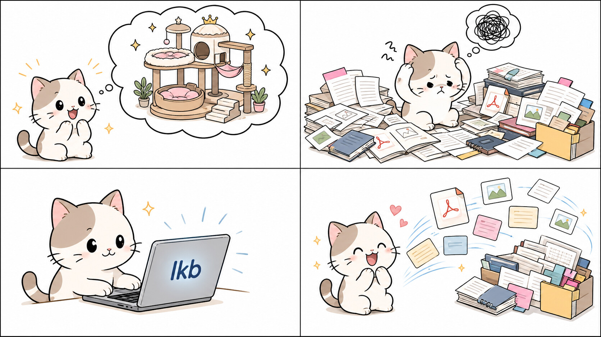

# [English README](README.md)

# Local Knowledge Bridge

`Local Knowledge Bridge` 是一个本地优先的 Codex 知识网关。它会在模型依赖自身记忆之前，先检索你的笔记、文献库、PDF、Office 文档和本地文件夹。

## 项目介绍

<p align="center">
  
</p>

你真正需要的答案，很多时候早就在自己的电脑里：一条 Obsidian 笔记、一篇 Zotero 论文、一个 EndNote 附件、去年下载的 PDF，或者某个项目文件夹里的资料。问题不在于知识不存在，而在于你能不能足够快地找到它、用上它。

`Local Knowledge Bridge` 会为 Codex 打通一条通往本地资料的可检索路径。你只需要用自然语言提问，使用 `$Local Knowledge Bridge`、写出 `Local Knowledge Bridge`，或者在请求中的任意位置加入 `lkb`，Codex 就可以先检索你配置的本地资料，再回答问题。

## 功能亮点

- 自然语言优先：日常使用直接在 Codex 中写 `$Local Knowledge Bridge`、`Local Knowledge Bridge` 或 `lkb`，不需要手动运行搜索命令。
- 汇聚分散知识：把 Obsidian、EndNote、Zotero 和本地文件夹接入同一个本地检索层。
- 本地、默认只读：索引、日志、模型、运行时文件和配置都保留在本机；项目只读取你配置的数据源，不会对你的知识库做任何编辑操作。
- 检索模式实用：`fast` 适合快速查找，`balanced` 适合更充分的证据检索，可选 `deep` 用于本地语义检索和 reranking。
- 面向证据回答：让 Codex 先查看你的笔记、论文、批注和文档，再退回到模型通用记忆。
- 需要时仍可脚本化：`lkb_*` 命令仍可用于安装、诊断、重建索引、自动化和开发。

## 支持的数据源

| 数据源 | 范围 |
| --- | --- |
| `Obsidian` 知识库 | Markdown 笔记和笔记分块 |
| `EndNote` 文献库 | 文献库记录，以及可读取的 PDF、Markdown、文本、DOCX、PPTX、XLSX 附件 |
| `Zotero` 文献库 | 文献库记录、笔记、批注、全文缓存和可读取附件 |
| 本地文件夹 | Markdown、文本、PDF、DOCX、PPTX、XLSX 文件 |

## 赞助

很高兴这个项目能遇见你。

我把它开源出来，是真心希望它能为你带来一点帮助。也许是节省一段摸索的时间，也许是解决一个棘手的问题，又或者是成为你前行的路上，一块小小的垫脚石。

愿你始终勇敢，不负韶华，在属于自己的征途上披荆斩棘、一往无前。

如果这个项目曾在某个时刻照亮过你，而你恰好有余力，欢迎请我喝杯咖啡，或者留下一份赞助。你的每一份支持，都会让这个工具走得更远，也让我更有动力把它打磨得更好。

| 支持方式 | 链接 |
| --- | --- |
| 微信 | [](https://github.com/kiiichi/local-knowledge-bridge/raw/refs/heads/main/assets/sponsor-wechat.png) |
| PayPal | [](https://www.paypal.com/paypalme/kiiichi) |

## 前期准备

| 需求 | 说明 |
| --- | --- |
| Windows PowerShell | 安装脚本和部署后的命令包装器会使用 PowerShell |
| Python 3.11+，可通过 `py` 或 `python` 调用 | 用 `py -3 --version` 或 `python --version` 检查 |
| Codex desktop，或其他使用 `%USERPROFILE%\.codex` 的 Codex 环境 | 安装器会把 skill 和 gateway 部署到你的 Codex home |
| 至少一个可读取的本地知识源 | Obsidian、EndNote、Zotero 或本地文件夹 |

## 快速启动

在仓库根目录双击 `lkb_setup.cmd`，或在 PowerShell 中运行：

```powershell
cd <repo>\local-knowledge-bridge
.\lkb_setup.cmd
```

安装向导会询问你要执行哪一种操作：

- 配置已有部署
- 安装或重新部署 Local Knowledge Bridge

当维护向导要求输入数据源路径时，直接粘贴原始路径，不要加引号，即使路径里有空格。

### 安装选项

安装或重新部署时，`Copy` 模式是普通用户的默认选择：它会把 gateway 和 skill 复制到你的 Codex home，让已安装工具保持稳定。`Link` 模式主要用于开发：已安装的 gateway 和 skill 会指向当前仓库，因此本地源码改动不需要重新安装就能生效。

`deep` 模式是可选项。它会启用本地 embedding 和 reranking 模型，用于更深入的语义检索，但需要额外依赖，并会在 `gateway/.models/` 下下载约 6 GB 模型。第一次部署时选择 `deep` 可能耗时较长，网络较慢时尤其明显。你可以先跳过它，之后再从维护向导启用；`fast` 和 `balanced` 不需要加载 deep 模型也能使用。

选择配置后，会打开已部署的维护向导。你可以在其中添加或编辑 Obsidian、EndNote、Zotero 和文件夹数据源，选择 route-weight 预设，配置 deep 检索，查看状态，并重建数据库。

### 后续启用 Deep 模式

第一次安装时可以跳过 `deep`。之后如果要启用，请再次运行 `lkb_setup.cmd`，选择已有部署配置路径，而不是重新部署：

```powershell
cd <repo>\local-knowledge-bridge
.\lkb_setup.cmd
```

依次选择：

1. `Configure existing deployment`
2. `Configure deep retrieval`
3. `Install deep dependencies and prefetch models`

默认 `BAAI/bge-m3` embedding 模型和 `BAAI/bge-reranker-v2-m3` reranker 约需下载 6 GB。预取过程中控制台会显示下载进度和速度。

不要为了补装 `deep` 直接选择 `Install or redeploy`；重新部署用于替换已安装的 gateway 和 skill，只应在你确实要重装部署文件时使用。

下载后检查就绪状态：

```powershell
$LKB = "$env:USERPROFILE\.codex\Function\local_knowledge_bridge"
& "$LKB\lkb_doctor.cmd" --json
```

当 `deep_status.ready` 为 `true` 后，就可以在 search、ask 或 report 命令中使用 `--profile deep`。

### 在 Codex 中使用

完成设置后，请在 Codex 中用自然语言使用它。在提出问题或布置任务时包含 `lkb`，或显式调用 skill `$Local Knowledge Bridge`，就可以让 Codex 优先检索已配置的本地资料。你也可以使用 `lkbsearch`、`lkbreport` 和 `lkbask` 这三个简写触发词，明确告诉 Codex 你想要哪种输出；也可以使用 `fast`、`balanced`/`balance` 或 `deep` 来显式规定搜索深度。

日常使用时，可以把一次 LKB 请求理解成两个相互独立的选择：

1. 搜索模式：你想要哪种输出。
2. 搜索深度：你希望 LKB 查得多深。

这两个选择都可以自动。如果你不确定怎么选，直接写 `lkb` 加上你的问题，让 Codex 自动判断即可。想更明确时，也可以在同一句提示词里显式指定搜索模式、搜索深度，或同时指定两者。

搜索模式决定输出形态。最简单的选择方式，是先想清楚你希望 LKB 帮你完成哪类任务：

| 情景 | 使用 | LKB 应该做什么 | 来源处理方式 |
| --- | --- | --- | --- |
| “我还不确定要什么输出形式，先帮我查本地资料并处理这个问题。” | `lkb` 或 `$Local Knowledge Bridge` | Codex 根据你的请求自动选择检索、报告或回答。新手不确定时从这里开始。 | 来源处理方式取决于 Codex 自动选择的模式。 |
| “我想罗列二战期间被讨论过的主流思潮。” | `lkbsearch` | 输出按相关度排序的本地候选材料列表，包含片段和路径，让你先看本地有哪些材料，并能自己打开来源继续检查。 | `DATA SOURCES` 可以列出所有已展示命中；编号按最终检索排序去重后生成。 |
| “我想把二战期间主流思潮被热烈讨论的时间排成先后顺序。” | `lkbreport` | 输出结构化证据综述，比较来源，整理证据，再帮助你形成时间顺序或材料脉络。 | `DATA SOURCES` 可以列出所有已展示证据命中，因为 report 本身就是证据面。 |
| “我想分析这些主流思潮之间有什么共性。” | `lkbask` | 输出基于本地证据写成的简洁回答，把关键判断和分析推理附上引用。 | `DATA SOURCES` 应只列正文实际引用过的来源；有帮助但未引用的候选命中应放入 `ADDITIONAL RETRIEVED SOURCES`。 |

搜索深度决定检索力度：

| 搜索深度 | 如何表达 | 适合场景 |
| --- | --- | --- |
| 自动 | 不写搜索深度，或在 Codex 提示词中写 `auto`。 | 让 Codex 根据任务自动选择。新手默认用这个最稳。 |
| Fast | `fast` | 快速检查、简单问题、低延迟查找。 |
| Balanced | `balanced`；自然语言里写 `balance` 也可以 | 更广的本地召回，但不加载 deep 模型。适合希望本地材料查得更完整时使用。 |
| Deep | `deep` | 本地语义检索和 reranking。适合复杂研究问题、文献综述，或你的问题和原文措辞不完全一致时使用。需要先完成 deep 设置。 |

搜索模式和搜索深度可以自然组合：

| 组合 | 示例提示词 |
| --- | --- |
| 自动模式 + 自动深度 | `lkb 我的笔记里关于 Transformer 模型压缩说了什么？` |
| 自动模式 + 显式深度 | `lkb deep，总结我的本地资料中关于连续变量簇态的内容。` |
| 显式模式 + 自动深度 | `lkbsearch，罗列二战期间被讨论过的主流思潮。` |
| 检索 + balanced 深度 | `lkbsearch balanced，查找本地关于被动线性光学的资料。` |
| 报告 + deep 深度 | `lkbreport deep，把二战期间主流思潮被热烈讨论的时间排成先后顺序。` |
| 回答 + fast 深度 | `lkbask fast：我的 CRISPR 脱靶检测笔记的主要结论是什么？` |
| 回答 + deep 深度 | `lkbask deep：基于我的 EndNote 和 Obsidian 来源，连续变量簇态无边图是否还有量子关联？` |

同一次输出中的来源编号应全局唯一，例如 `[1]`、`[2]`、`[3]`，不要在 `Literature`、`Documents` 或其他来源分组中重新编号。对于 `lkbask`，正文中的事实判断和分析推理应使用同一套编号引用本地证据，例如 `……[1]` 或 `根据 [1], [3] 可以推断……`。

在 PowerShell 中运行诊断：

```powershell
$LKB = "$env:USERPROFILE\.codex\Function\local_knowledge_bridge"
& "$LKB\lkb_doctor.cmd" --json
```

## 命令概览

主要部署命令：

- `lkb_wizard.cmd` - 维护向导，用于数据源配置、route weight、deep 设置和索引重建
- `lkb_search.cmd` - 原始检索结果，用于检查候选来源
- `lkb_report.cmd` - 基于检索材料生成结构化证据报告
- `lkb_ask.cmd` - 基于已引用本地证据生成回答
- `lkb_index.cmd` / `lkb_refresh.cmd` - 索引状态和重建
- `lkb_doctor.cmd` - 数据源、索引、服务、版本和 deep 诊断
- `lkb_bootstrap_runtime.cmd` - 嵌入式运行时修复，以及可选 deep 模型预取

检索目标：

- `both` - 所有已配置的数据源类型
- `obsidian`
- `endnote`
- `zotero`
- `folder`

检索配置（profiles）：

- `auto` - 自然语言中的简写，表示让 Codex 自动选择检索配置；如果直接使用 CLI，不指定 `--profile` 即可，除非你想显式指定某个 profile
- `fast` - 轻量本地检索，适合快速回答，默认使用
- `balanced` - 更广的轻量检索
- `deep` - 使用本地模型进行语义评分和 reranking

## 安装和配置细节

推荐始终从引导入口开始：

```powershell
.\lkb_setup.cmd
```

非交互安装：

```powershell
.\scripts\install_windows.ps1 -Mode Copy -BootstrapRuntime
```

开发安装，本地源码改动会立即反映到部署结果：

```powershell
.\scripts\install_windows.ps1 -Mode Link -BootstrapRuntime
```

如果 PowerShell 阻止脚本：

```powershell
powershell -ExecutionPolicy Bypass -File .\scripts\lkb_setup.ps1
```

仍然可以手动配置数据源：

```powershell
& "$LKB\lkb_configure.cmd" --obsidian "D:\Notes\Vault"
& "$LKB\lkb_configure.cmd" --endnote "D:\EndNote\My Library.enl" --endnote-name "Main Library"
& "$LKB\lkb_configure.cmd" --zotero "$env:APPDATA\Zotero\Zotero\Profiles\<profile>\zotero\zotero.sqlite"
& "$LKB\lkb_configure.cmd" --folder-library "D:\Research Materials" --folder-name "Research Materials"
```

向导和 CLI 只会编辑 LKB 配置和生成的索引。移除数据源配置不会删除你的真实笔记、文献库、附件或文件夹。

## 索引

构建或重建本地数据库：

```powershell
& "$LKB\lkb_index.cmd" --force
```

查看索引状态：

```powershell
& "$LKB\lkb_index.cmd" --status
```

数据源变化后刷新：

```powershell
& "$LKB\lkb_refresh.cmd"
```

## 可选 Deep 检索

`deep` 使用 `.models` 下的机器本地模型文件，不会在查询时懒下载。

准备 deep 依赖并预取默认模型：

```powershell
& "$LKB\lkb_bootstrap_runtime.cmd" --include-deep --prefetch-models
```

检查就绪状态：

```powershell
& "$LKB\lkb_doctor.cmd" --json
```

测试 deep 检索：

```powershell
& "$LKB\lkb_search.cmd" both "passive linear optics" --profile deep --limit 5 --no-service
```

如果你希望使用 GPU deep 检索，请确认嵌入式运行时可以看到 CUDA：

```powershell
nvidia-smi
& "$LKB\runtime\py311\python.exe" -c "import torch; print(torch.__version__); print(torch.version.cuda); print(torch.cuda.is_available()); print(torch.cuda.get_device_name(0) if torch.cuda.is_available() else 'no cuda')"
```

## 开发

在仓库根目录运行测试：

```powershell
python -m unittest discover -s gateway\tests
```

编译检查主要入口：

```powershell
python -m py_compile gateway\lkb_wizard.py gateway\src\local_knowledge_bridge\wizard.py gateway\src\local_knowledge_bridge\terminal_ui.py
```

源码位置：

- `gateway/lkb_*.py` - CLI 入口
- `gateway/src/local_knowledge_bridge/` - 共享实现模块
- `gateway/templates/lkb_config.template.json` - 默认配置
- `scripts/` - 仓库安装和设置脚本
- `skill/` - 安装到 Codex 的 skill 内容

以下生成的本地状态不应提交：

- `gateway/runtime/`
- `gateway/.cache/`
- `gateway/.index/`
- `gateway/.logs/`
- `gateway/.models/`
- `gateway/lkb_config.json`

## 故障排查

如果数据源路径不存在或不可读：

```powershell
& "$LKB\lkb_configure.cmd" --show
& "$LKB\lkb_doctor.cmd" --json
```

如果服务路径失败或出现 `ConnectionResetError`，检查服务日志并用 `--no-service` 重试：

```powershell
Get-Content "$LKB\.logs\service.log" -Tail 80
& "$LKB\lkb_search.cmd" both "passive linear optics" --profile balanced --limit 5 --no-service
```

如果 `deep_status.ready` 是 `false`，重新运行：

```powershell
& "$LKB\lkb_bootstrap_runtime.cmd" --include-deep --prefetch-models
```
